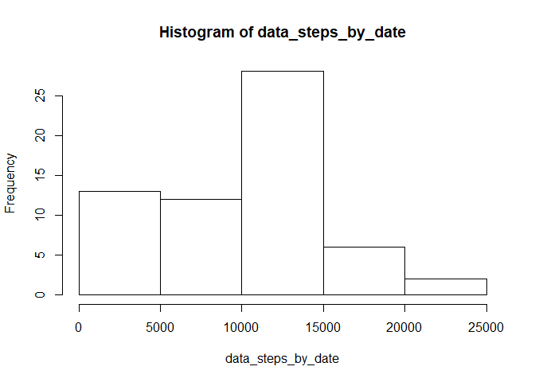
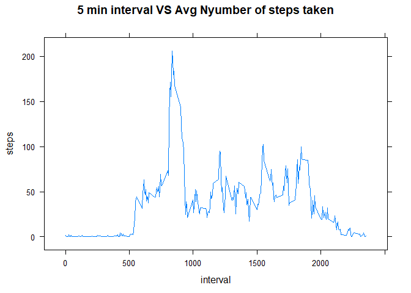
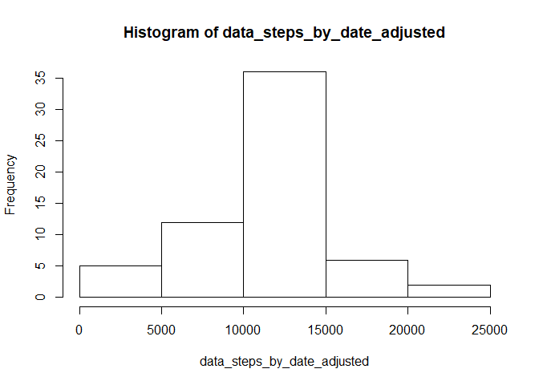
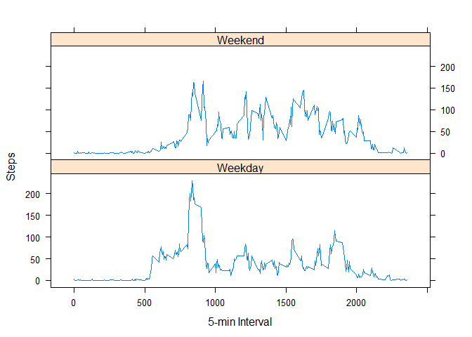

# Reproducible Research: Peer Assessment 1

```r
library(lattice)
library(data.table)
```

```
## Warning: package 'data.table' was built under R version 3.3.2
```

```r
library(lubridate)
```

```
## Warning: package 'lubridate' was built under R version 3.3.3
```

```
## 
## Attaching package: 'lubridate'
```

```
## The following objects are masked from 'package:data.table':
## 
##     hour, isoweek, mday, minute, month, quarter, second, wday,
##     week, yday, year
```

```
## The following object is masked from 'package:base':
## 
##     date
```


## Q1: Loading and preprocessing the data

```r
# A: Load the data (i.e. read.csv())
#Process/transform the data (if necessary) into a format suitable for your analysis

# We are downloading the dataset directly from the github repo:

temp <- tempfile()
download.file("https://github.com/lesliebogdan/RepData_PeerAssessment1/raw/master/activity.zip",temp)
data <- read.csv(unz(temp, "activity.csv"))
unlink(temp)
```

## Q2: What is mean total number of steps taken per day?


```r
# A: Calculate the total number of steps taken per day

data_steps_by_date<-tapply(data$steps,data$date,sum,na.rm=TRUE)

# B: If you do not understand the difference between a histogram and a barplot, research the difference between them. Make a histogram of the total number of steps taken each day

hist(data_steps_by_date)
```

<!-- -->

```r
# C: Calculate and report the mean and median of the total number of steps taken per day

steps_by_date_mean<-mean(data_steps_by_date)

steps_by_date_median<-median(data_steps_by_date)
```

### **A2: Reportable:**  

The Total mean steps by day is 9354.2295082  
The Total median steps by day is 10395

## Q3: What is the average daily activity pattern?


```r
# A: Make a time series plot (i.e. type = "l") of the 5-minute interval (x-axis) and the average number of steps taken, averaged across all days (y-axis)

data_mean_steps<-aggregate(data$steps,list(data$interval),mean,na.rm=TRUE)

names(data_mean_steps)<-c("interval","steps")

xyplot(steps~interval,
       data = data_mean_steps,
       type = "l",
       main="5 min interval VS Avg Nyumber of steps taken")
```

<!-- -->

```r
# B: Which 5-minute interval, on average across all the days in the dataset, contains the maximum number of steps?

max_interval<-data_mean_steps[which.max(data_mean_steps$steps),]
```

### **A3: Reportable:**
The 5-minute interval which on average has the maxium number of steps across all days is    
interval:835

## Q4: Imputing missing values


```r
# A: Calculate and report the total number of missing values in the dataset (i.e. the total number of rows with NAs)

Missing_values<-sum(is.na(data$steps))

# B: Devise a strategy for filling in all of the missing values in the dataset. The strategy does not need to be sophisticated. For example, you could use the mean/median for that day, or the mean for that 5-minute interval, etc.

   # Strategy I will use is: mean for that 5 min interval across all days will be used to replace the NA value (data_mean_steps created above will be used as the reference to fill in values)

# C: Create a new dataset that is equal to the original dataset but with the missing data filled in.

#copy data set
data_adjusted<-data

# if you find a NA, look up by the interval in the 'data_mean_steps' df
data_adjusted$steps <- ifelse(is.na(data_adjusted$steps) == TRUE,
                              data_mean_steps$steps[data_mean_steps$interval %in% data_adjusted$interval], data_adjusted$steps)  

Missing_values_adjusted<-sum(is.na(data_adjusted$steps))


# D: Make a histogram of the total number of steps taken each day and Calculate and report the mean and median total number of steps taken per day. Do these values differ from the estimates from the first part of the assignment? What is the impact of imputing missing data on the estimates of the total daily number of steps?

data_steps_by_date_adjusted<-tapply(data_adjusted$steps,data_adjusted$date,sum)

hist(data_steps_by_date_adjusted)
```

<!-- -->

```r
steps_by_date_mean_adjusted<-format(round(mean(data_steps_by_date_adjusted),2),nsmall=2)

steps_by_date_median_adjusted<-format(round(median(data_steps_by_date_adjusted),2),nsmall=2)
```

### **A4: Reportable:**

Count of Missing Values in original data set is: 2304  
Count of Missing Values after treatment of NA values is: 0 

The Total mean steps by day is (for the adjusted data set):   10766.19  
  Part 1 mean was: 9354.2295082  
The Total median steps by day is (for the adjusted data set):   10766.19  
  Part 1 median was: 10395  
  
Impact is to increase the mean and median values
This makes sense in that we are not treating the NA records as 0 as we did in part 1 (did not consider them at all), but rather we 'guessed' a value which is greater than 0 so it will always increase the mean + median values produced.

## Q5:Are there differences in activity patterns between weekdays and weekends?


```r
# A: Create a new factor variable in the dataset with two levels - "weekday" and "weekend" indicating whether a given date is a weekday or weekend day.

# make as.Date
data_adjusted$date<-ymd(as.character(data_adjusted$date))

# Add extra column which marks up either as 'Weekday' or 'Weekend'
data_adjusted$week <-
ifelse(weekdays(data_adjusted$date) %in% c("Saturday", "Sunday"), "Weekend", "Weekday")

# B: Make a panel plot containing a time series plot (i.e. type = "l") of the 5-minute interval (x-axis) and the average number of steps taken, averaged across all weekday days or weekend days (y-axis). See the README file in the GitHub repository to see an example of what this plot should look like using simulated data.

# Find the avg per day values for both the 'weekend' and 'weekday' days
data_adjusted_mean<-aggregate(data_adjusted$steps,list(data_adjusted$interval,data_adjusted$week),mean)

# give names to columns
names(data_adjusted_mean)<-c("interval","week","steps")

# make the panel plots to compare 'weekday' and 'weekend' values
xyplot(data_adjusted_mean$steps~data_adjusted_mean$interval|data_adjusted_mean$week,
       type='l',layout=c(1,2),
       xlab='5-min Interval',ylab='Steps')
```

<!-- -->

### **A5: Reportable:**

There seems to be differences between 'weekend' and 'weekday' value  
Looks like more concentrated activity on weekdays over a shorter period of time  
earlier in the day, then activity drops off  
Looks like weekends have sustained activity longer into the day

